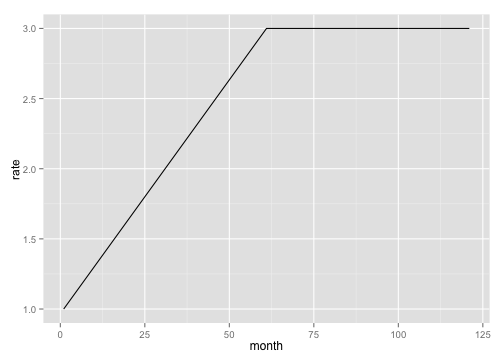
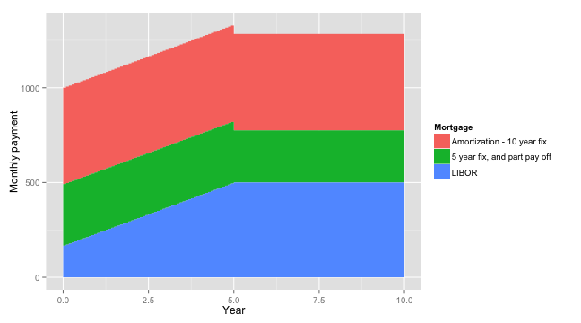
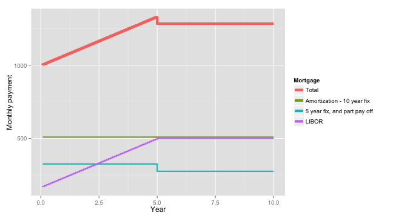

<!--
%\VignetteEngine{knitr}
-->


# Swiss Mortgage Calculator

## Define the interest rates
### Current fixed rates
Define a vector giving the current fixed rate mortgages for a fixed period of 1 to 10 years.

```r
currentFixRates <- c(0.98, 0.96, 1.02, 1.15, 1.3, 1.46, 1.62, 1.78, 1.92, 2.06)
```


### LIBOR rates
The `flex.rate` function defines what you think the interest rate will be in the next 10 years.
The current LIBOR rate is 1%, and we think this will rise to 3% in the next 5 years, and stay there.  

```r
flexRate <- flex.rate(times = c(0, 5), rates = c(1, 3), last.time = 10)
ggplot(flexRate, aes(x = month, y = rate)) + geom_line()
```

 


## Define the mortgage plan
The mortgage plan is made up of three mortgages:
* An amortization mortgage for 100'000 CHF, with a 10 year fixed rate and amortization period of 20 years.
* An interest only mortgage for 300'000 CHF, with a 5 year fixed rate.
  * 200'000 CHF of this is then paid off, and another interest only mortgage is started for the remaining 100'000 CHF, with a 5 year fixed rate.
* An interest only mortgage for for 200'000 CHF, with a LIBOR rate. 


```r
shinyPlan <- list(
  "Amortization - 10 year fix" = list(
    list(debt = 100000, fix.rate = TRUE,  period = 10, interest.only = FALSE,  amortization.period = 20)
  ),
  "5 year fix, and part pay off" = list(
    list(debt = 300000, fix.rate = TRUE, period = 5, interest.only = TRUE),
    list(debt = 100000, fix.rate = TRUE, period = 5, interest.only = TRUE)
  ),
  "LIBOR" = list(
    list(debt = 200000, fix.rate = FALSE, period = 10, interest.only = TRUE)
  )
)
```


## Add in the interest rates needed for the calculations

```r
plan <- shinyPlan2plan(
  shinyPlan = shinyPlan,
  currentFixRates = currentFixRates,
  flexRate = flexRate
  )
```


## Perform the calculations

```r
pay <- plan.pay(plan)
```


## See the results
### Summary

```r
summaryPay(pay)
```


<!-- html table generated in R 3.0.0 by xtable 1.7-1 package -->
<!-- Sun Jun  9 20:45:27 2013 -->
<TABLE border=1>
<TR> <TH> Mortgage </TH> <TH> Sub mortgage </TH> <TH> Year start </TH> <TH> Year end </TH> <TH> Debt start </TH> <TH> Average rate </TH> <TH> Repayment type </TH> <TH> Interest </TH> <TH> Amortizaton </TH> <TH> Total </TH>  </TR>
  <TR> <TD> Amortization - 10 year fix </TD> <TD align="right"> 1 </TD> <TD align="right"> 0.0 </TD> <TD align="right"> 10.0 </TD> <TD align="right"> 100 000 </TD> <TD align="right"> 2.06 </TD> <TD> Amortization </TD> <TD align="right"> 16 175 </TD> <TD align="right"> 44 873 </TD> <TD align="right"> 61 048 </TD> </TR>
  <TR> <TD> 5 year fix, and part pay off </TD> <TD align="right"> 1 </TD> <TD align="right"> 0.0 </TD> <TD align="right"> 5.0 </TD> <TD align="right"> 300 000 </TD> <TD align="right"> 1.30 </TD> <TD> Interest </TD> <TD align="right"> 19 500 </TD> <TD align="right"> 0 </TD> <TD align="right"> 19 500 </TD> </TR>
  <TR> <TD>  </TD> <TD align="right"> 2 </TD> <TD align="right"> 5.0 </TD> <TD align="right"> 10.0 </TD> <TD align="right"> 100 000 </TD> <TD align="right"> 3.30 </TD> <TD> Interest </TD> <TD align="right"> 16 500 </TD> <TD align="right"> 0 </TD> <TD align="right"> 16 500 </TD> </TR>
  <TR> <TD> LIBOR </TD> <TD align="right"> 1 </TD> <TD align="right"> 0.0 </TD> <TD align="right"> 10.0 </TD> <TD align="right"> 200 000 </TD> <TD align="right"> 2.49 </TD> <TD> Interest </TD> <TD align="right"> 49 833 </TD> <TD align="right"> 0 </TD> <TD align="right"> 49 833 </TD> </TR>
  <TR> <TD> Total </TD> <TD align="right">  </TD> <TD align="right"> 0.0 </TD> <TD align="right"> 10.0 </TD> <TD align="right">  </TD> <TD align="right">  </TD> <TD>  </TD> <TD align="right"> 102 008 </TD> <TD align="right"> 44 873 </TD> <TD align="right"> 146 881 </TD> </TR>
   </TABLE>


### Plots

```r
ribbon.plot.pay(pay)
```

 


```r
line.plot.pay(pay)
```

 

