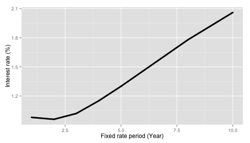
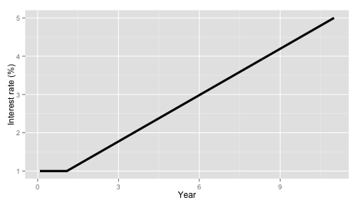
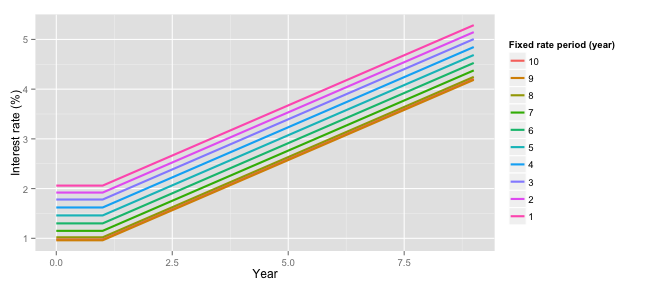
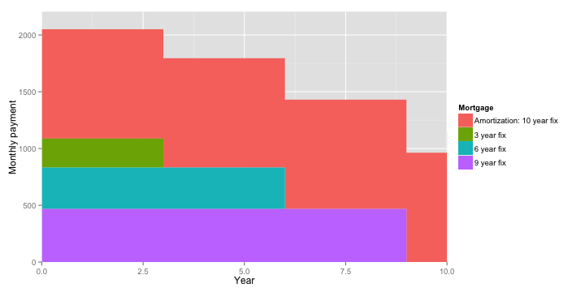
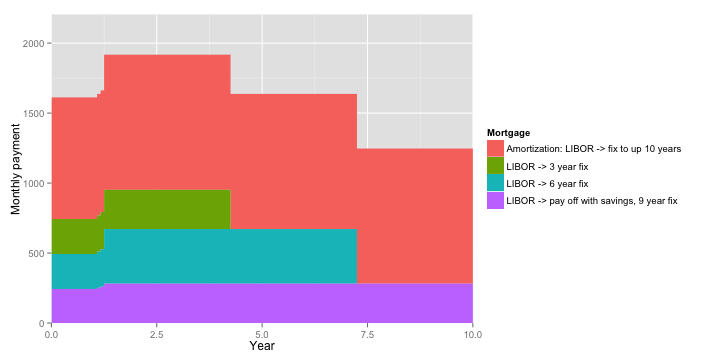
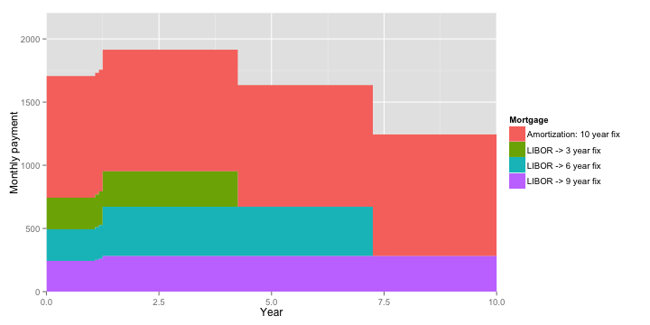

# Mortgage Calculations

## Total costs

<!-- html table generated in R 3.0.0 by xtable 1.7-1 package -->
<!-- Mon May 20 21:48:31 2013 -->
<TABLE border=1>
<TR> <TH>  </TH> <TH> CHF </TH>  </TR>
  <TR> <TD align="right"> Land </TD> <TD align="right"> 271'000 </TD> </TR>
  <TR> <TD align="right"> Haus </TD> <TD align="right"> 1'024'000 </TD> </TR>
  <TR> <TD align="right"> Parkplatz </TD> <TD align="right"> 39'000 </TD> </TR>
  <TR> <TD align="right"> Velobox </TD> <TD align="right"> 5'000 </TD> </TR>
  <TR> <TD align="right"> Dusche </TD> <TD align="right"> 12'700 </TD> </TR>
  <TR> <TD align="right"> Total </TD> <TD align="right"> 1'351'700 </TD> </TR>
   </TABLE>

## Mortage parts
* __Deposit__: Up to 20% of the total mortgage needed.
* __1st mortgage__: 66% of total. is typically an interest only mortage, that can be __fixed__ over a period of time, or linked to the __LIBOR__ rate.
* __Amortization mortgage__: The remainder. Must be amortized over the next 20 years. This can be fixed or LIBOR.

The amortization mortage can be paid by indirect amortization.
* Only the interest is paid directly
* The amortizaiton part is paid into a 3rd pillar, and is then used to pay off the mortgage. 
* This has tax advantages as the 3rd pillar payments are made pre-tax.

A building loan is needed for a new build house. 
* This usually has a different interest rate from the typical fixed or LIBOR rates for a 1st mortgage. 
* This may have an admin fee.
* It may be possible to take out a staggered 1st mortage during the building phase.

### Mortgage is made up of

<!-- html table generated in R 3.0.0 by xtable 1.7-1 package -->
<!-- Mon May 20 21:48:31 2013 -->
<TABLE border=1>
<TR> <TH>  </TH> <TH> CHF </TH>  </TR>
  <TR> <TD align="right"> Deposit </TD> <TD align="right"> 270'340 </TD> </TR>
  <TR> <TD align="right"> First </TD> <TD align="right"> 892'122 </TD> </TR>
  <TR> <TD align="right"> Amortization </TD> <TD align="right"> 189'238 </TD> </TR>
   </TABLE>

## Assumptions about interest rates
### Plot of current fix rate interest rates

 

### Plot of flexible rates interest rates over time  

 

### Plot of fixed interest rates by period over time  

 

## Assumptions about savings
* Assume can save 100'000 CHF per year.

## General strategy
* Have several fixed rate mortgages. Structure them, so that when they come to the 
end of the period there should be enough cash to pay them off if wanted.

### Option 1: 3 fixed rate mortages; of times 3, 6, and 9 years; for 300'000, 3000'000 and the remainder

### Option 2: LIBOR mortgage. When rates rise switch to 3 fixed rate mortages; of times 3, 6, and 9 years; for 300'000, 3000'000 and the remainder. Assume these start 3 months after the rate change. Use initial saved money to pay off 9 year fixed rate

### Option 3: Fixed rate amortization mortgage, LIBOR on fixed mortgages. When rates rise switch to 3 fixed rate mortages; of times 3, 6, and 9 years; for 300'000, 3000'000 and the remainder. Assume these start 3 months after the rate change. Use initial saved money to pay off 9 year fixed rate

## Summary of mortgages
### Option 1: 3 fixed rate mortages; of times 3, 6, and 9 years; for 300'000, 3000'000 and the remainder

 
<!-- html table generated in R 3.0.0 by xtable 1.7-1 package -->
<!-- Mon May 20 21:48:36 2013 -->
<TABLE border=1>
<TR> <TH> Mortgage </TH> <TH> Sub mortgage </TH> <TH> Year start </TH> <TH> Year end </TH> <TH> Debt start </TH> <TH> Average rate </TH> <TH> Repayment type </TH> <TH> Interest </TH> <TH> Amortizaton </TH> <TH> Total </TH>  </TR>
  <TR> <TD> Amortization: 10 year fix </TD> <TD align="right"> 1 </TD> <TD align="right"> 0.0 </TD> <TD align="right"> 10.0 </TD> <TD align="right"> 189 238 </TD> <TD align="right"> 2.06 </TD> <TD> Amortization </TD> <TD align="right"> 30 609 </TD> <TD align="right"> 84 916 </TD> <TD align="right"> 115 525 </TD> </TR>
  <TR> <TD> 3 year fix </TD> <TD align="right"> 1 </TD> <TD align="right"> 0.0 </TD> <TD align="right"> 3.0 </TD> <TD align="right"> 300 000 </TD> <TD align="right"> 1.02 </TD> <TD> Interest </TD> <TD align="right"> 9 180 </TD> <TD align="right"> 0 </TD> <TD align="right"> 9 180 </TD> </TR>
  <TR> <TD> 6 year fix </TD> <TD align="right"> 1 </TD> <TD align="right"> 0.0 </TD> <TD align="right"> 6.0 </TD> <TD align="right"> 300 000 </TD> <TD align="right"> 1.46 </TD> <TD> Interest </TD> <TD align="right"> 26 280 </TD> <TD align="right"> 0 </TD> <TD align="right"> 26 280 </TD> </TR>
  <TR> <TD> 9 year fix </TD> <TD align="right"> 1 </TD> <TD align="right"> 0.0 </TD> <TD align="right"> 9.0 </TD> <TD align="right"> 292 122 </TD> <TD align="right"> 1.92 </TD> <TD> Interest </TD> <TD align="right"> 50 479 </TD> <TD align="right"> 0 </TD> <TD align="right"> 50 479 </TD> </TR>
  <TR> <TD> Total </TD> <TD align="right">  </TD> <TD align="right"> 0.0 </TD> <TD align="right"> 10.0 </TD> <TD align="right">  </TD> <TD align="right">  </TD> <TD>  </TD> <TD align="right"> 116 548 </TD> <TD align="right"> 84 916 </TD> <TD align="right"> 201 464 </TD> </TR>
   </TABLE>

### Option 2: LIBOR mortgage. When rates rise switch to 3 fixed rate mortages; of times 3, 6, and 9 years; for 300'000, 3000'000 and the remainder. Assume these start 3 months after the rate change. Use initial saved money to pay off 9 year fixed rate

 
<!-- html table generated in R 3.0.0 by xtable 1.7-1 package -->
<!-- Mon May 20 21:48:38 2013 -->
<TABLE border=1>
<TR> <TH> Mortgage </TH> <TH> Sub mortgage </TH> <TH> Year start </TH> <TH> Year end </TH> <TH> Debt start </TH> <TH> Average rate </TH> <TH> Repayment type </TH> <TH> Interest </TH> <TH> Amortizaton </TH> <TH> Total </TH>  </TR>
  <TR> <TD> Amortization: LIBOR -&gt  fix to up 10 years </TD> <TD align="right"> 1 </TD> <TD align="right"> 0.0 </TD> <TD align="right"> 1.2 </TD> <TD align="right"> 189 238 </TD> <TD align="right"> 0.98 </TD> <TD> Amortization </TD> <TD align="right"> 2 257 </TD> <TD align="right"> 10 772 </TD> <TD align="right"> 13 029 </TD> </TR>
  <TR> <TD>  </TD> <TD align="right"> 2 </TD> <TD align="right"> 1.2 </TD> <TD align="right"> 10.0 </TD> <TD align="right"> 178 466 </TD> <TD align="right"> 2.16 </TD> <TD> Amortization </TD> <TD align="right"> 27 001 </TD> <TD align="right"> 74 365 </TD> <TD align="right"> 101 366 </TD> </TR>
  <TR> <TD> LIBOR -&gt  3 year fix </TD> <TD align="right"> 1 </TD> <TD align="right"> 0.0 </TD> <TD align="right"> 1.2 </TD> <TD align="right"> 300 000 </TD> <TD align="right"> 1.01 </TD> <TD> Interest </TD> <TD align="right"> 3 775 </TD> <TD align="right"> 0 </TD> <TD align="right"> 3 775 </TD> </TR>
  <TR> <TD>  </TD> <TD align="right"> 2 </TD> <TD align="right"> 1.2 </TD> <TD align="right"> 4.2 </TD> <TD align="right"> 300 000 </TD> <TD align="right"> 1.12 </TD> <TD> Interest </TD> <TD align="right"> 10 088 </TD> <TD align="right"> 0 </TD> <TD align="right"> 10 088 </TD> </TR>
  <TR> <TD> LIBOR -&gt  6 year fix </TD> <TD align="right"> 1 </TD> <TD align="right"> 0.0 </TD> <TD align="right"> 1.2 </TD> <TD align="right"> 300 000 </TD> <TD align="right"> 1.01 </TD> <TD> Interest </TD> <TD align="right"> 3 775 </TD> <TD align="right"> 0 </TD> <TD align="right"> 3 775 </TD> </TR>
  <TR> <TD>  </TD> <TD align="right"> 2 </TD> <TD align="right"> 1.2 </TD> <TD align="right"> 7.2 </TD> <TD align="right"> 300 000 </TD> <TD align="right"> 1.56 </TD> <TD> Interest </TD> <TD align="right"> 28 095 </TD> <TD align="right"> 0 </TD> <TD align="right"> 28 095 </TD> </TR>
  <TR> <TD> LIBOR -&gt  pay off with savings, 9 year fix </TD> <TD align="right"> 1 </TD> <TD align="right"> 0.0 </TD> <TD align="right"> 1.2 </TD> <TD align="right"> 292 122 </TD> <TD align="right"> 1.01 </TD> <TD> Interest </TD> <TD align="right"> 3 676 </TD> <TD align="right"> 0 </TD> <TD align="right"> 3 676 </TD> </TR>
  <TR> <TD>  </TD> <TD align="right"> 2 </TD> <TD align="right"> 1.2 </TD> <TD align="right"> 10.0 </TD> <TD align="right"> 167 122 </TD> <TD align="right"> 2.02 </TD> <TD> Interest </TD> <TD align="right"> 29 551 </TD> <TD align="right"> 0 </TD> <TD align="right"> 29 551 </TD> </TR>
  <TR> <TD> Total </TD> <TD align="right">  </TD> <TD align="right"> 0.0 </TD> <TD align="right"> 10.0 </TD> <TD align="right">  </TD> <TD align="right">  </TD> <TD>  </TD> <TD align="right"> 108 218 </TD> <TD align="right"> 85 137 </TD> <TD align="right"> 193 355 </TD> </TR>
   </TABLE>

### Option 3: Fixed rate amortization mortgage, LIBOR on fixed mortgages. When rates rise switch to 3 fixed rate mortages; of times 3, 6, and 9 years; for 300'000, 3000'000 and the remainder. Assume these start 3 months after the rate change. Use initial saved money to pay off 9 year fixed rate

 
<!-- html table generated in R 3.0.0 by xtable 1.7-1 package -->
<!-- Mon May 20 21:48:39 2013 -->
<TABLE border=1>
<TR> <TH> Mortgage </TH> <TH> Sub mortgage </TH> <TH> Year start </TH> <TH> Year end </TH> <TH> Debt start </TH> <TH> Average rate </TH> <TH> Repayment type </TH> <TH> Interest </TH> <TH> Amortizaton </TH> <TH> Total </TH>  </TR>
  <TR> <TD> Amortization: 10 year fix </TD> <TD align="right"> 1 </TD> <TD align="right"> 0.0 </TD> <TD align="right"> 10.0 </TD> <TD align="right"> 189 238 </TD> <TD align="right"> 2.06 </TD> <TD> Amortization </TD> <TD align="right"> 30 609 </TD> <TD align="right"> 84 916 </TD> <TD align="right"> 115 525 </TD> </TR>
  <TR> <TD> LIBOR -&gt  3 year fix </TD> <TD align="right"> 1 </TD> <TD align="right"> 0.0 </TD> <TD align="right"> 1.2 </TD> <TD align="right"> 300 000 </TD> <TD align="right"> 1.01 </TD> <TD> Interest </TD> <TD align="right"> 3 775 </TD> <TD align="right"> 0 </TD> <TD align="right"> 3 775 </TD> </TR>
  <TR> <TD>  </TD> <TD align="right"> 2 </TD> <TD align="right"> 1.2 </TD> <TD align="right"> 4.2 </TD> <TD align="right"> 300 000 </TD> <TD align="right"> 1.12 </TD> <TD> Interest </TD> <TD align="right"> 10 088 </TD> <TD align="right"> 0 </TD> <TD align="right"> 10 088 </TD> </TR>
  <TR> <TD> LIBOR -&gt  6 year fix </TD> <TD align="right"> 1 </TD> <TD align="right"> 0.0 </TD> <TD align="right"> 1.2 </TD> <TD align="right"> 300 000 </TD> <TD align="right"> 1.01 </TD> <TD> Interest </TD> <TD align="right"> 3 775 </TD> <TD align="right"> 0 </TD> <TD align="right"> 3 775 </TD> </TR>
  <TR> <TD>  </TD> <TD align="right"> 2 </TD> <TD align="right"> 1.2 </TD> <TD align="right"> 7.2 </TD> <TD align="right"> 300 000 </TD> <TD align="right"> 1.56 </TD> <TD> Interest </TD> <TD align="right"> 28 095 </TD> <TD align="right"> 0 </TD> <TD align="right"> 28 095 </TD> </TR>
  <TR> <TD> LIBOR -&gt  9 year fix </TD> <TD align="right"> 1 </TD> <TD align="right"> 0.0 </TD> <TD align="right"> 1.2 </TD> <TD align="right"> 292 122 </TD> <TD align="right"> 1.01 </TD> <TD> Interest </TD> <TD align="right"> 3 676 </TD> <TD align="right"> 0 </TD> <TD align="right"> 3 676 </TD> </TR>
  <TR> <TD>  </TD> <TD align="right"> 2 </TD> <TD align="right"> 1.2 </TD> <TD align="right"> 10.0 </TD> <TD align="right"> 167 122 </TD> <TD align="right"> 2.02 </TD> <TD> Interest </TD> <TD align="right"> 29 551 </TD> <TD align="right"> 0 </TD> <TD align="right"> 29 551 </TD> </TR>
  <TR> <TD> Total </TD> <TD align="right">  </TD> <TD align="right"> 0.0 </TD> <TD align="right"> 10.0 </TD> <TD align="right">  </TD> <TD align="right">  </TD> <TD>  </TD> <TD align="right"> 109 570 </TD> <TD align="right"> 84 916 </TD> <TD align="right"> 194 485 </TD> </TR>
   </TABLE>

